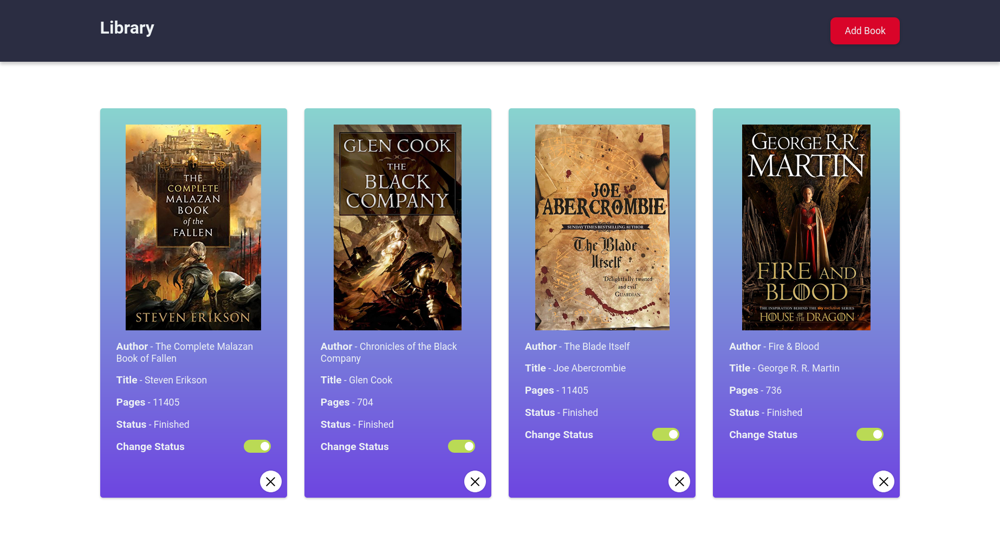

# Odin Project - Library Challange

This is a solution to Odin Projects Library challange.

## Table of contents

- [Overview](#overview)
  - [Screenshot](#screenshot)
  - [Links](#links)
- [Author](#author)

## Overview

This is a simple 2 page website with 3 views, mobile, tablets and desktop, only html and css was used in process

### Screenshot

### Links

[Click to view live site]()

## Author

Hello, I'm Ucha, you might know me as [gwynbleidd0014](https://github.com/gwynbleidd0014) on github
